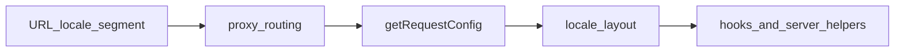

# ADR-0009: Runtime locale authority for App Router

## Status

Accepted

## Context

Afenda uses Next.js App Router with `next-intl`. Localized runtime UI lives under `src/app/[locale]/`. Locale routing is defined in [`src/i18n/routing.ts`](../../src/i18n/routing.ts), edge shaping in [`src/proxy.ts`](../../src/proxy.ts), and per-request config in [`src/i18n/request.ts`](../../src/i18n/request.ts). The root locale layout binds the locale for RSC and the client tree.

Separately, [ADR-0005](./0005-continuous-localization-operating-model.md) governs **translation supply** (Git-native catalogs, compile order, validation). That must not be confused with **which locale a given HTTP request renders**.

Without a single written authority, mature products accumulate competing sources (cookie, tenant default, profile, headers) that silently override the URL, breaking auditability, support, SEO alignment, and static rendering assumptions.

## Decision

1. **Doctrine [I18N-RUNTIME-001](../doctrine/0009-i18n-runtime-locale-authority.md):** For App Router runtime pages, the **`[locale]` URL segment** is the sole **runtime** locale authority. `next-intl` resolves, validates, binds, and distributes it. Preference signals (cookies, tenant defaults, headers, profile, `Accept-Language`) may affect **entrypoint redirects** or **initial path construction** only; they must not silently override an already resolved localized route inside request rendering.

2. **Resolution flow (runtime):**

3. **`explicitRequestLocale` in `getRequestConfig`:** The `locale` argument supplied by next-intl alongside `requestLocale` is treated as an **internal adapter / testing override** only. It must pass the same **`hasLocale(routing.locales, …)`** validation as `requestLocale`. It is **not** a channel for tenant defaults, user profile, cookies, or headers. Production features must not use it as a preference backdoor.

4. **Relationship to ADR-0005:** ADR-0005 owns **how strings get into `messages/`** (source / generated / fallback, compile, CI). ADR-0009 owns **which locale the App Router request renders** for a localized URL. Both apply; neither replaces the other.

## Consequences

**Positive**

- One runtime locale record per localized request; rendering does not guess.
- Clear boundary: preference vs resolved vs redirect vs docs availability vs translation workflow.
- Keeps `next-intl`; no migration to other i18n libraries required by this decision.

**Tradeoffs**

- Tenant or user “preferred locale” must be expressed through **redirect into** a localized URL (or cookie for **next** unlocalized entry), not by overriding `getRequestConfig` for `/vi/...`.
- Missing copy remains a **fallback policy** problem (catalogs / merge), not a locale authority problem.

## Enforcement (this slice)

- Doctrine **I18N-RUNTIME-001** and this ADR are the normative references.
- [`src/i18n/README.md`](../../src/i18n/README.md) and [`AGENTS.md`](../../AGENTS.md) point agents and operators to the invariant.
- Module JSDoc on [`src/i18n/request.ts`](../../src/i18n/request.ts) documents authority at the code boundary.

## Future work (explicitly not required now)

- Optional static check (e.g. flag `cookies().get('…locale')`, `headers().get('accept-language')`, tenant/user locale reads inside `src/app/[locale]` render paths) — **no new CI script in this ADR’s initial slice.**
- UX follow-up for [`TenantLocaleSync`](../../src/i18n/tenant-locale-sync.tsx) (e.g. reload behavior) — separate PR if needed; must preserve invariant that **`request.ts` does not read preferences for resolved locale**.

## Related decisions

- **[ADR-0005](./0005-continuous-localization-operating-model.md)** — translation supply (catalogs, compile, CI).
- **[ADR-0010](./0010-tolgee-localization-operations-platform.md)** (Proposed) — optional **Tolgee** TMS for translation **operations** only; must not change this ADR’s runtime locale authority.

## References

- next-intl request configuration: https://next-intl.dev/docs/usage/configuration
- next-intl routing setup: https://next-intl.dev/docs/routing/setup
- Next.js internationalization: https://nextjs.org/docs/app/guides/internationalization
